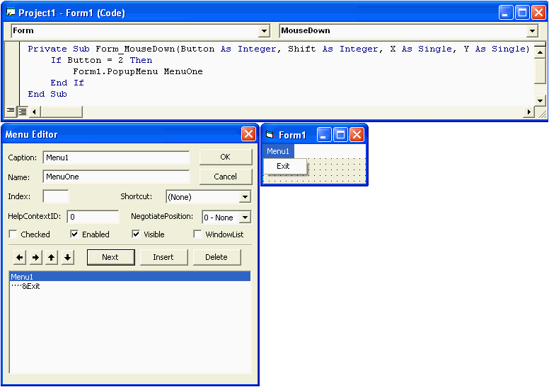



## How to Add a Right Click/Pop\-up Mouse Menu\.

### Description

Step by Step on how to How to Add a Right Click/Pop-up Mouse Menu to your project.
 
### More Info
 

             |
---                |---
**Submitted On**   |
**By**             |[KaveMan](https://github.com/Planet-Source-Code/PSCIndex/blob/master/ByAuthor/kaveman.md)
**Level**          |Beginner
**User Rating**    |4.5 (18 globes from 4 users)
**Compatibility**  |VB 6\.0
**Category**       |[Custom Controls/ Forms/  Menus](https://github.com/Planet-Source-Code/PSCIndex/blob/master/ByCategory/custom-controls-forms-menus__1-4.md)
**World**          |[Visual Basic](https://github.com/Planet-Source-Code/PSCIndex/blob/master/ByWorld/visual-basic.md)
**Archive File**   |

### Source Code

 

 <table border="0" cellpadding="0" cellspacing="0" style="border-collapse: collapse" bordercolor="#111111" width="90%" id="AutoNumber1">
  <tr>
   <td width="100%" colspan="2" valign="top">
   
<b>How to Add a Right Click/Pop-up Mouse
   Menu.</b></td>
  </tr>
  <tr>
   <td width="8%" valign="top" nowrap>&nbsp;</td>
   <td valign="top">&nbsp;</td>
  </tr>
  <tr>
   <td width="8%" valign="top" nowrap><u>Step 1:</u></td>
   <td valign="top">Start a New Standard .EXE Project</td>
  </tr>
  <tr>
   <td width="8%" valign="top" nowrap>&nbsp;</td>
   <td valign="top">&nbsp;</td>
  </tr>
  <tr>
   <td width="8%" valign="top" nowrap><u>Step 2:</u></td>
   <td valign="top">Click on Tools &gt; Menu editor (Opens Menu Editor Dialog)</td>
  </tr>
  <tr>
   <td width="8%" valign="top" nowrap>&nbsp;</td>
   <td valign="top">&nbsp;</td>
  </tr>
  <tr>
   <td width="8%" valign="top" nowrap><u>Step 3:</u></td>
   <td valign="top">Put 'Menu1' in the Caption then put 'MenuOne' for the
   Name. Click the 'Next' Button.</td>
  </tr>
  <tr>
   <td width="8%" valign="top" nowrap>&nbsp;</td>
   <td valign="top">&nbsp;</td>
  </tr>
  <tr>
   <td width="8%" valign="top" nowrap><u>Step 4:</u></td>
   <td valign="top">Put 'Test1' in the Caption then put 'TestOne' for the
   Name. Now click on the arrow that is pointing right (You should see four
   dots next to Test1). Then click the 'OK' button.</td>
  </tr>
  <tr>
   <td width="8%" valign="top" nowrap>&nbsp;</td>
   <td valign="top">&nbsp;</td>
  </tr>
  <tr>
   <td width="8%" valign="top" nowrap><u>Step 5:</u></td>
   <td valign="top">Go to the Visual Basic Menu and click on View &gt; Code and
   add this:</td>
  </tr>
  <tr>
   <td width="8%" valign="top" nowrap>&nbsp;</td>
   <td valign="top">
   Private Sub Form_MouseDown(Button As Integer, Shift As Integer, X As Single, Y As Single)  
   &nbsp;&nbsp;&nbsp;If Button = 2 Then  
   &nbsp;&nbsp;&nbsp;&nbsp;&nbsp;&nbsp;Form1.PopupMenu MenuOne  
   &nbsp;&nbsp;&nbsp;End If  
   End Sub</td>
  </tr>
  <tr>
   <td width="8%" valign="top" nowrap>&nbsp;</td>
   <td valign="top">&nbsp;</td>
  </tr>
  <tr>
   <td width="8%" valign="top" nowrap><u>Step 6:</u></td>
   <td valign="top">Click on Run &gt; Start (or press the 'F5' button on the
   keyboard).</td>
  </tr>
  <tr>
   <td width="8%" valign="top" nowrap>&nbsp;</td>
   <td valign="top">&nbsp;</td>
  </tr>
  <tr>
   <td width="8%" valign="top" nowrap><i>Notes:</i></td>
   <td valign="top"><i>Button 1 = Left Mouse Button 
   Button 2 = Right Mouse Button 
   Button 3 = Explore Left Mouse Button 
   Button 4 = Middle Mouse Button 
   Button 5 = Explore Right Mouse Button</i></td>
  </tr>
 </table>
 

&nbsp;

